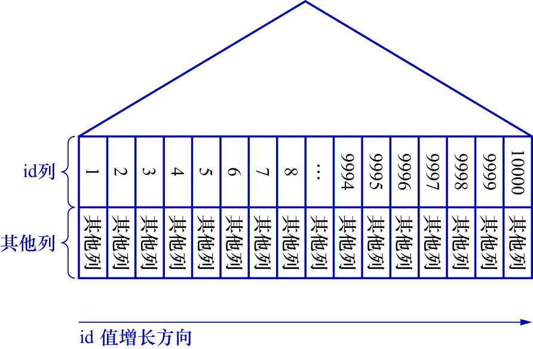
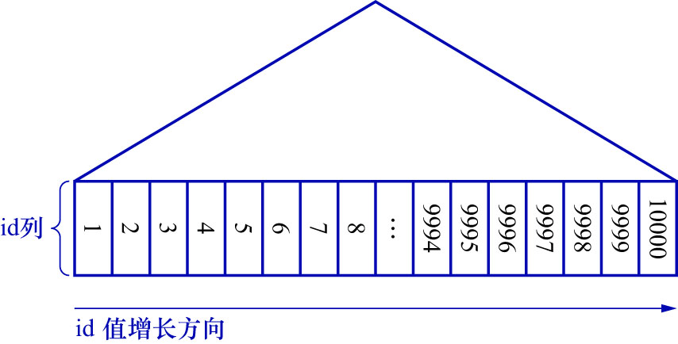
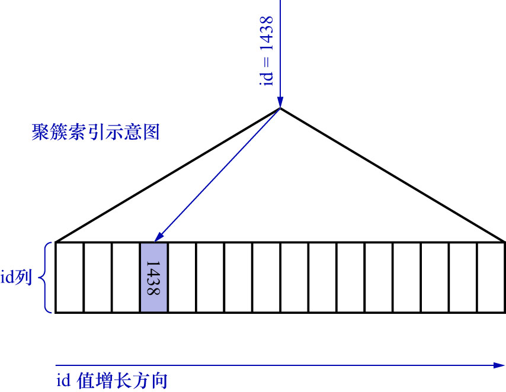
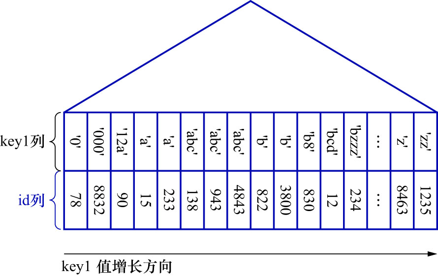
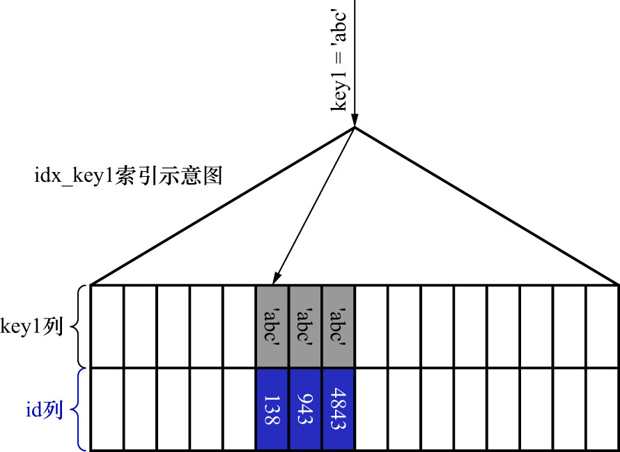

# 1. B+树索引示意图的简化

现有一张表如下:

```
mysql> CREATE TABLE single_table (
    ->     id INT NOT NULL AUTO_INCREMENT,
    ->     key1 VARCHAR(100),
    ->     key2 INT,
    ->     key3 VARCHAR(100),
    ->     key_part1 VARCHAR(100),
    ->     key_part2 VARCHAR(100),
    ->     key_part3 VARCHAR(100),
    ->     common_field VARCHAR(100),
    ->     PRIMARY KEY (id),
    ->     KEY idx_key1 (key1),
    ->     UNIQUE KEY uk_key2 (key2),
    ->     KEY idx_key3 (key3),
    ->     KEY idx_key_part (key_part1, key_part2, key_part3)
    -> ) ENGINE=InnoDB CHARSET=utf8mb4;
Query OK, 0 rows affected (0.02 sec)
```

在`single_table`表中,建立了1个聚簇索引和4个二级索引,分别是:

- `id`列的聚簇索引
- `key1`列的二级索引`idx_key1`
- `key2`列的唯一二级索引`uk_key2`
- `key3`列的二级索引`idx_key3`
- `key_part1`/`key_part2`/`key_part3`列的二级索引`idx_key_part`,注意这是一个联合索引

为这个表插入10000行记录,除`id`列外,其他列的值都随机生成,脚本如下:

```php
<?php
$host = '192.168.1.171';           	// 数据库主机
$db   = 'charset_demo_db';     		// 数据库名
$user = 'root';       				// 数据库用户名
$pass = '123456';       			// 数据库密码
$charset = 'utf8mb4';

$dsn = "mysql:host=$host;dbname=$db;charset=$charset";
$options = [
    PDO::ATTR_ERRMODE            => PDO::ERRMODE_EXCEPTION,
    PDO::ATTR_DEFAULT_FETCH_MODE => PDO::FETCH_ASSOC,
];

function randomString($length = 10) {
    return substr(str_shuffle(str_repeat('abcdefghijklmnopqrstuvwxyzABCDEFGHIJKLMNOPQRSTUVWXYZ0123456789', 10)), 0, $length);
}

try {
    $pdo = new PDO($dsn, $user, $pass, $options);

    $total = 10000;
    $batchSize = 100;
    $sql = "INSERT INTO single_table 
        (key1, key2, key3, common_field, key_part1, key_part2, key_part3) 
        VALUES (?, ?, ?, ?, ?, ?, ?)";
    $stmt = $pdo->prepare($sql);

    $currentKey2 = 1; // key2为唯一约束 必须唯一

    for ($i = 0; $i < $total; $i++) {
        $key1 = randomString(8);
        $key2 = $currentKey2++; // 唯一整数
        $key3 = randomString(8);
        $common_field = randomString(8);
        $key_part1 = randomString(6);
        $key_part2 = randomString(6);
        $key_part3 = randomString(6);

        $stmt->execute([$key1, $key2, $key3, $common_field, $key_part1, $key_part2, $key_part3]);
        // 批量插入时可考虑事务
        if ($i % $batchSize === 0) {
            echo "Inserted $i records...\n";
        }
    }
    echo "插入完成!\n";
} catch (PDOException $e) {
    die("数据库连接失败: " . $e->getMessage());
}
```

B+树的形状可以描述为一个"矮矮的大胖子",且我们现在也知道如何使用B+树快速地定位记录.

把`single_table`表的聚簇索引示意图简化后,如下图示:



后续中,**把聚簇索引叶子节点中的记录称为聚簇索引记录**.聚簇索引记录是按照主键值由小到大的顺序排序的.

把图中的"其他列"也去掉,只保留`id`列的聚簇索引记录,简化后的示意图如下:



通过聚簇索引对应的B+树,可以很容易地定位到主键等于某个值的聚簇索引记录,例如:通过这个B+树定位到`id = 1438`的记录,如下图示:



在二级索引`idx_key1`对应的B+树中,保留了叶子节点的记录.这些记录包括`key1`列/`id`列的值.这些记录按照`key1`列的值由小到大的顺序排序,
若`key1`列的值相同,则按照`id`列的值由小到大的顺序排序.如下图示:



后续中,把**二级索引叶子节点中的记录称为二级索引记录**.

如果想查找`key1`的值等于某个值的二级索引记录,那么通过`idx_key1`对应的B+树,可以很容易地定位到第1条`key1`列的值等于某个值的二级索引记录,
然后沿着记录所在的单向链表向后扫描即可.如下图示:


