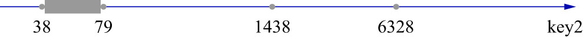
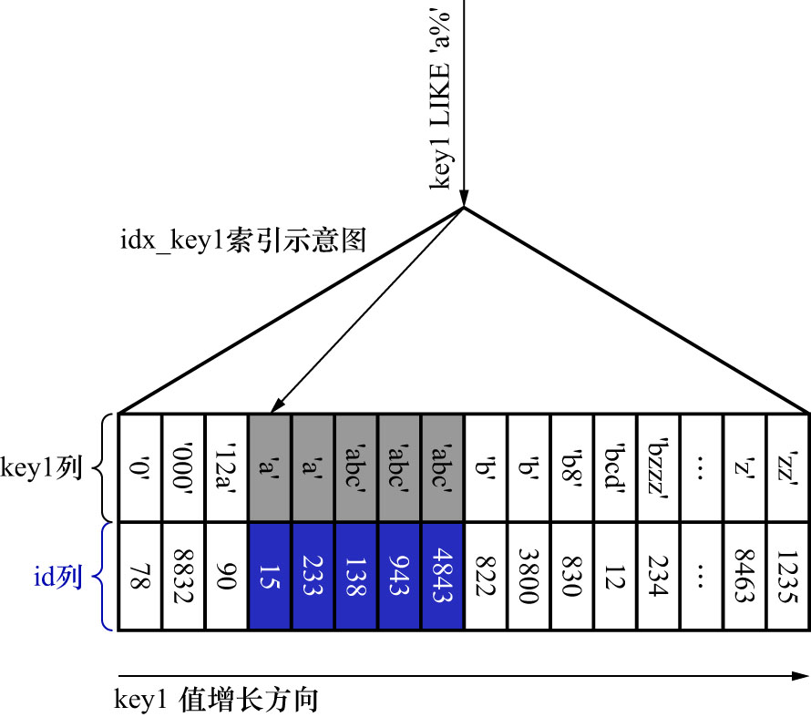

# 0. 前言

对于某个查询来说,最简单粗暴的执行方案就是扫全表,判断每一条记录是否符合搜索条件.若符合,则将该条记录发送给客户端;否则跳过该记录.
这种执行方案被称为全表扫描.对于使用InnoDB存储引擎的表来说,全表扫描意味着从聚簇索引的第1个叶子节点的第1条记录开始,
沿着记录所在的单向链表向后扫描,直到最后1个叶子节点的最后1条记录.虽然全表扫描是一种很笨的执行方案,但是它是万能的执行方案,所有的查询都可以
使用这种方案来执行.

由于B+树叶子节点中的记录是按照索引列的值,由小到大的顺序排序的,所以只扫描某个区间或某些区间中的记录,可以明显减少需要扫描的记录数量.
例如下面这个查询:

```sql
SELECT * 
FROM single_table 
WHERE id >= 2 AND id <= 100;
```

这个语句其实是要查找`id ∈ [2, 100]`这个区间中的所有聚簇索引记录.可以通过聚簇索引对应的B+树,快速定位到`id = 2`的那条聚簇索引记录,
然后沿着记录所在的单向链表向后扫描,直到某条聚簇索引记录的`id`值不在区间`[2, 100]`中为止(即: `id`值不再符合条件`id <= 100`).

和全表扫描相比,扫描`id ∈ [2, 100]`这个区间中的记录,已经很大程度地减少了需要扫描的记录数量,所以提升了查询效率.

后续的例子中,把待扫描记录的索引列值所在的区间称为**扫描区间**;把形成这个扫描区间的条件称为这个扫描区间的**边界条件**.

注: 其实对于全表扫描来说,其扫描区间为`id ∈ (-∞, +∞)`

对于下面这个查询语句:

```sql
SELECT * 
FROM single_table 
WHERE key2 IN (1438, 6328)
OR (
    key2 >= 38 AND key2 <= 79
)
```

查询条件涉及`key2`列,且我们为`key2`列建立了唯一索引`uk_key2`.如果使用`uk_key2`执行这个查询,则相当于从以下3个扫描区间中获取二级索引记录:

- `key2 ∈ [1438, 1438]`: 对应的边界条件为`KEY 2 IN (1438)`
- `key2 ∈ [6328, 6328]`: 对应的边界条件为`KEY 2 IN (6328)`
- `key2 ∈ [38, 79]`: 对应的边界条件为`key2 >= 38 AND key2 <= 79`

这些扫描区间对应到数轴上,如下图示:



把类似于`[1438, 1438]`/`[6328, 6328]`这样,只包含1个值的扫描区间称为**单点扫描区间**;
把类似于`[38, 79]`这样,包含多个值的扫描区间称为**范围扫描区间**

另外,由于这条SQL的查询列表为`*`,也就是需要读取完整的用户记录,所以从上述扫描区间中,每获取1条二级索引记录,就需要根据该二级索引记录的`id`列的值,
执行回表操作,也就是到聚簇索引中找到对应的聚簇索引记录.

注: 不仅可以使用`uk_key2`执行该查询,也可以使用`idx_key1`/`idx_key3`/`idx_key_part`来执行该查询.
这里以`idx_key1`为例来解释为什么不使用这些索引.

显然,对二级索引`idx_key1`的B+树而言,该SQL的搜索条件无法形成合适的扫描区间,进而也就无法实现"减少需要扫描的`idx_key1`的数量"这一目的.
那么就只能扫描`idx_key1`的全部二级索引记录,针对获取到的每一条二级索引记录,都需要再执行回表操作来获取完整的用户记录.也就是说,使用`idx_key1`
执行查询时,该SQL的扫描区间为`(-∞, +∞)`.

这个方案是可以实施的,但不仅没有优化性能,反而会降低性能.最简单粗暴的全表扫描方式就已经能够完成查询了,而采用这个方案,不仅要全表扫描,还要扫描全部
的`idx_key1`二级索引记录.效率反而比全表扫描还差.

因此,**如果想使用某个索引来执行查询,但是又无法通过搜索条件形成合适的扫描区间来减少需要扫描的记录数量时,则不考虑使用该索引来执行查询**.

并不是所有的搜索条件都可以成为边界条件,比如这个SQL:

```sql
SELECT * 
FROM single_table 
WHERE key1 < 'a'
AND key3 > 'z'
AND common_field = 'abc';
```

- 如果使用`idx_key1`执行查询,那么扫描区间为:`key1 ∈ (-∞, 'a')`,形成扫描区间的边界条件就是`key1 < 'a'`
  - 而`key3 > 'z' AND common_field = 'abc'`就成为了普通搜索条件
  - 这些普通搜索条件需要在获取到`idx_key1`的二级索引并回表操作获取到完整的用户记录后,才能判断查到的这条数据是否符合这个条件
- 如果使用`idx_key3`执行查询,那么扫描区间为:`key3 ∈ ('z', +∞)`,形成扫描区间的边界条件就是`key3 > 'z'`
  - 而`key1 < 'a' AND common_field = 'abc'`就成为了普通搜索条件
  - 这些普通搜索条件需要在获取到`idx_key3`的二级索引并回表操作获取到完整的用户记录后,才能判断查到的这条数据是否符合这个条件

从这两个例子中可以看到,在使用某个索引执行查询时,关键的问题就是**通过搜索条件,找到合适的扫描区间,然后再到对应的B+树中扫描索引列值在这些扫描区间的记录**.
**对于每个扫描区间来说,只需要通过B+树定位到该扫描区间的第1条记录,然后就可以沿着记录所在的单向链表向后扫描,直到某条记录不符合形成该扫描区间的边界条件为止**.

对于B+树索引来说,只要索引列和常数使用`=`/`<=>`(安全等于)/IN/NOT IN/IS NULL/IS NOT NULL/`>`/`<`/`>=`/`<=`/`BETWEEN`/`!=`(也可以写成`<>`)/LIKE,
就可以形成扫描区间.但有几点需要注意:

- IN操作符的语义与若干个`=`之间用OR连接的语义相同,最终都会产生形成单点扫描区间

例如:

```sql
SELECT * 
FROM single_table 
WHERE key2 IN (1438, 6328);
```

等价于:

```sql
SELECT * 
FROM single_table 
WHERE key2 = 1438 OR key2 = 6328;
```

- `!=`产生的扫描区间比较容易被忽略

例如:

```sql
SELECT * 
FROM single_table 
WHERE key1 != 'a';
```

此时使用`idx_key1`执行查询,则扫描区间为:`key1 ∈ (-∞, 'a') ∪ ('a', +∞)`

- LIKE操作符只有在匹配完整的字符串或匹配字符串前缀时,才能产生扫描区间

比较字符串的大小,其实就相当于依次比较每个字符的大小.字符串比较的过程如下:

- 先比较字符串的第1个字符.第1个字符小的那个字符串就比较小
- 若2个字符串的第1个字符相同,则比较第2个字符.第2个字符小的那个字符串就比较小
- 若2个字符串的第2个字符也相同,则比较第3个.以此类推

对于某个索引列来说,字符串前缀相同的记录在单向链表中肯定是相邻的.

例如:搜索条件为`key1 LIKE 'a%'`,对于二级索引`idx_key1`来说,所有前缀为`'a'`的二级索引记录一定是相邻的.也就是说,
只要定位到`key1`值的字符串前缀为`'a'`的第1条二级索引记录,就可以沿着单向链表向后扫描,直到某条二级索引记录的`key1`值不再以`'a'`开头为止.
如下图示:



显然,搜索条件`key1 LIKE 'a%'`形成的扫描区间为`key1 ∈ ['a', 'b')`

**在执行一个查询语句时,首先要找出所有可用的索引,以及使用这些索引时对应的扫描区间**.