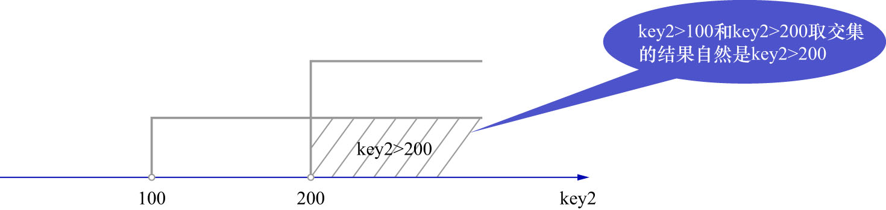
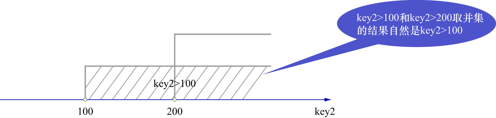

# 1. 所有搜索条件都可以生成合适的扫描区间的情况

在使用某个索引执行查询时,有时,每个小的搜索条件都可以生成一个合适的扫描区间来减少需要扫描的记录数量.

例如:

```sql
SELECT *
FROM single_table
WHERE key2 > 100
AND key2 > 200;
```

在使用索引`uk_key2`执行该查询时,`key2 > 100`和`key2 > 200`这2个搜索条件都可以形成各自的扫描区间.由于这2个条件使用AND连接,
所以最终的扫描区间是这2个搜索条件形成的扫描区间取交集的结果,如下图示:



`key2 > 100`和`key2 > 200`的交集为`key2 > 200`.也就是说在使用索引`uk_key2`执行该查询时的扫描区间为`key2 ∈ (200, +∞)`,
形成该扫描区间的边界条件为`key2 > 200`.

再来看一下使用OR连接多个搜索条件的情况:

```sql
SELECT *
FROM single_table
WHERE key2 > 100
OR key2 > 200;
```

OR就表示需要取各个扫描区间的并集,如下图示:



`key2 > 100`和`key2 > 200`的并集为`key2 > 100`.也就是说在使用索引`uk_key2`执行该查询时的扫描区间为`key2 ∈ (100, +∞)`,
形成该扫描区间的边界条件为`key2 > 100`.
