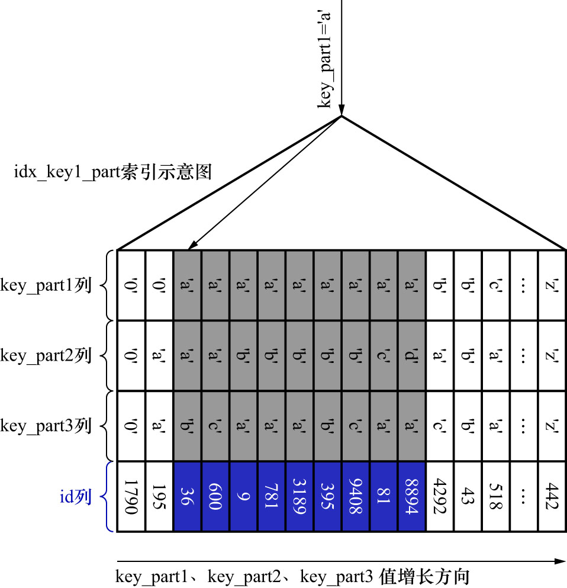

# 1. 联合索引中最左侧列的等值查询

联合索引`idx_key_part`的示意图如下:


SQL如下:

```sql
SELECT *
FROM single_table
WHERE key_part1 = 'a';
```

由于二级索引记录是先按照`key_part1`列的值排序的,所以符合条件`key_part1 ='a'`的所有记录肯定是相邻的.
以定位到符合条件`key_part1 ='a'`的第一条记录,然后沿着记录所在单向链表向后扫描
(如果本页面中的记录扫描完了,就根据叶子节点的双向链表找到下一个页面中的第一条记录,继续沿着记录所在的单向链表向后扫描.
之后就不强调叶子节点的双向链表了).直到某条记录不符合条件`key_part1 ='a'`为止(当然,对于获取到的每一条二级引记录都要执行回表操作).
如下图示:



即: 如果使用联合索引`idx_key_part`执行该査询语句,对应的扫描区间就是`key_part1 ∈ ['a', 'a']`,形成这个扫描区间的边界条件为`key_part1 = 'a'`
