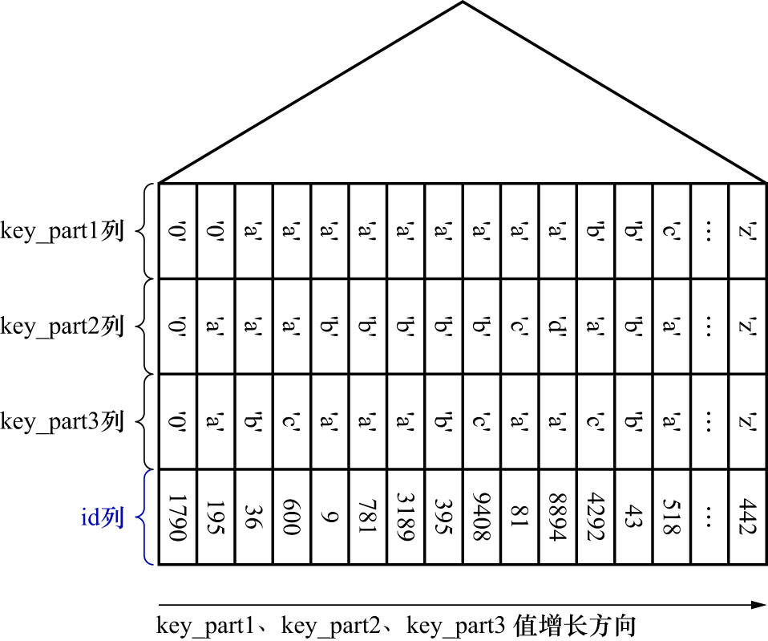
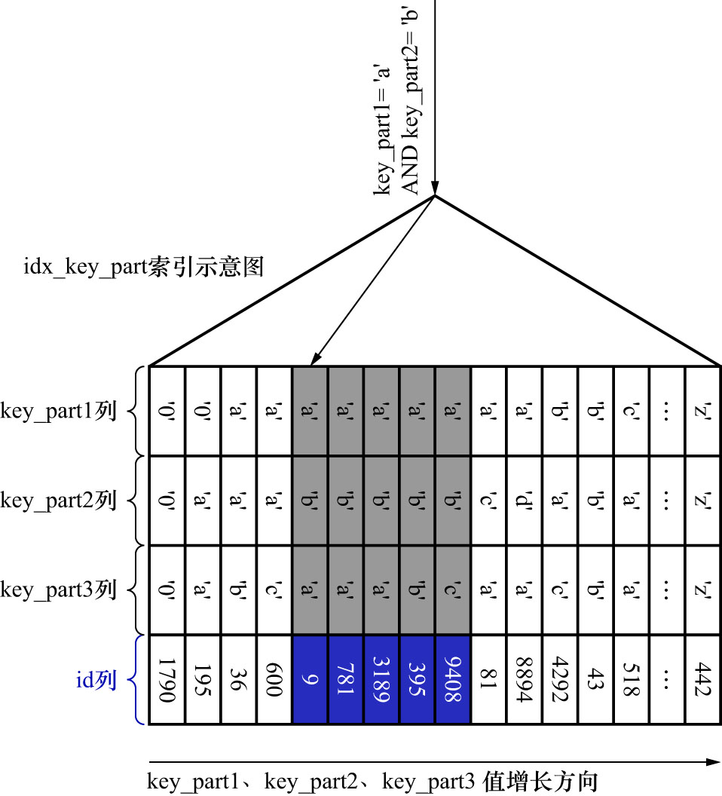

# 2. 联合索引中最左侧列的等值且中间列的等值查询

联合索引`idx_key_part`的示意图如下:



SQL如下:

```sql
SELECT *
FROM single_table
WHERE 
    key_part1 = 'a'
AND
    key_part2 = 'b';
```

由于二级索引记录是先按照`key_part1`列的值排序,若`key_part1`列的值相等,则再按照`key_part2`列的值排序,
所以符合条件`key_part1 = 'a' AND key_part2 = 'b'`的二级索引记录必然是相邻的.
因此可以定位到符合条件`key_part1 = 'a' AND key_part2 = 'b'`的第1条记录,然后沿着记录所在的单向链表向后扫描,
直到某条记录不符合条件`key_part1 = 'a' AND key_part2 = 'b'`为止(当然,对于获取到的每一条二级索引记录都要执行回表操作).
如下图示:



即: 如果使用联合索引`idx_key_part`执行该査询语句,对应的扫描区间就是`(key_part1, key_part2) ∈ [('a','b'), ('a','b')]`,
形成这个扫描区间的边界条件为`key_part1 = 'a' AND key_part2 = 'b'`
