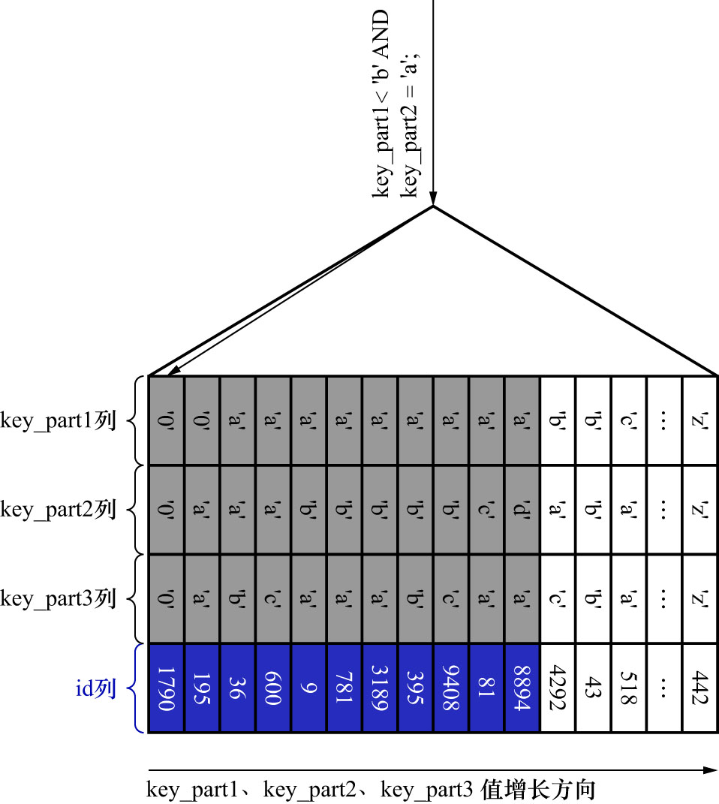

# 8. 联合索引中最左列的范围且中间列的等值查询

联合索引`idx_key_part`的示意图如下:


SQL如下:

```sql
SELECT *
FROM single_table
WHERE
    key_part1 < 'b'
AND
    key_part2 = 'a';
```

由于二级索引记录是先按照`key_part1`列的值排序的,所以符合条件`key_part1 < 'b'`的二级索引记录肯定是相邻的.
但是对于符合条件`key_part1 < 'b'`的二级索引记录来说,并不是按照`key_part2`列排序的.
也就是说,无法根据搜索条件`key_part2 = 'a'`来进一步需要扫描的记录数量.如果使用联合索引`idx_key_part`执行该査询语句,
可以定位到符合条件`key_part1 < 'b'`的第1条记录(其实就是联合索引`idx_key_part`的第1个叶子节点的第1条记录),
沿着记录所在的单向链表向后扫描,直到某条记录不符合条件`key_part1 < 'b'`为止.如下图示:



即: 如果使用联合索引`idx_key_part`执行该査询语句,对应的扫描区间就是`key_part1 ∈ (-∞, 'b')`,
形成这个扫描区间的边界条件为`key_part1 < 'b'`,与条件`key_part2 = 'a'`无关.
