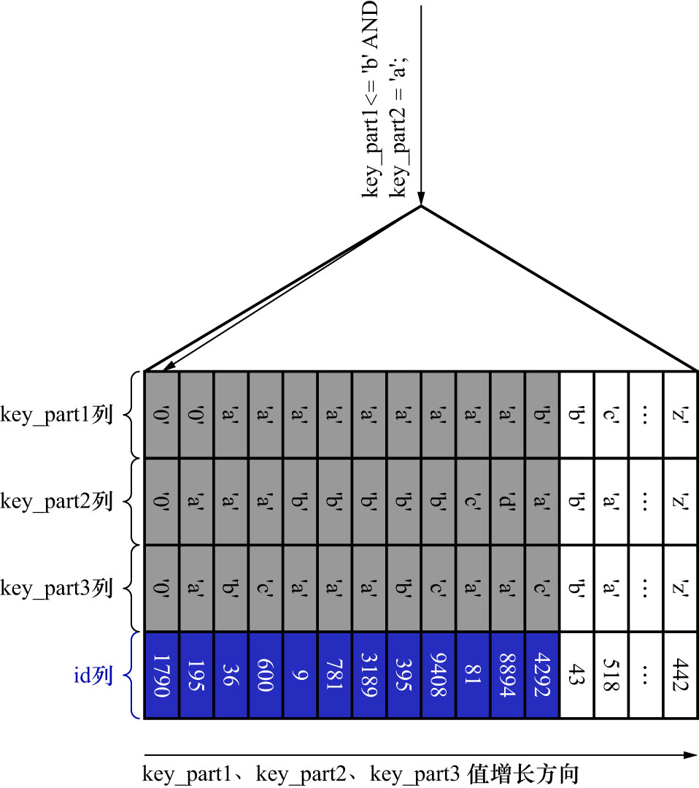

# 9. 联合索引中最左列的范围且中间列的等值查询(2)

联合索引`idx_key_part`的示意图如下:


SQL如下:

```sql
SELECT *
FROM single_table
WHERE
    key_part1 <= 'b'
AND
    key_part2 = 'a';
```

很显然这条查询语句和上一条非常像,但是在涉及`key_part1`的条件时,本条查询语句中的条件为`key_part1 <= 'b'`.
很显然符合条件`key_part1 <= 'b'`的二级索引记录是相邻的.但是对于符合条件`key_part1 <= 'b'`的二级索引记录来说,
并不是直接按照`key_part2`列排序的.(这些和上一条查询语句的分析完全相同)

而不同点在于: 符合条件`key_part1 = 'b'`的这一小部分二级索引记录,是按照`key_part2`列的值排序的.

那么在确定需要扫描的二级索引记录的范围时,**若二级索引记录的`key_part1`列值为'b',则可以通过条件`key_part2 = 'a'`减少需要扫描的二级索引记录范围**

也就是说,，当扫描到不符合条件`key_part1 = 'b'AND key_part2 = 'a'`的第1条记录时,就可以结束扫描,
而不需要将所有`key_part1 = 'b'`的记录全部扫描完.如下图示:



即: 如果使用联合索引`idx_key_part`执行该査询语句,对应的扫描区间就是`(key_part1, key_part2) ∈ ((-∞,a), ('b','a')]`,
形成这个扫描区间的边界条件为`key_part1 <= 'b' AND key_part2 = 'a'`.

而在执行上一条查询语句时,必须将所有符合条件`key_part1 < 'b'`的记录都扫描完,
条件`key_part2 = 'a'`在上一条査询语句中并不能起到减少需要扫描的二级索引记录范围的作用.
