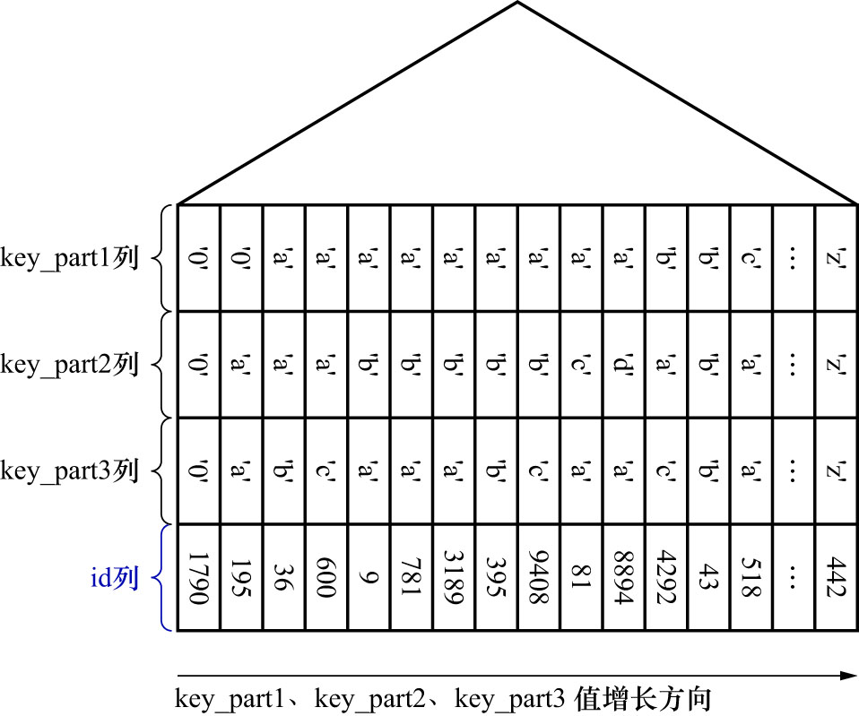

# 0. 前言

在编写查询语句时,经常需要使用ORDER BY子句对查询出来的记录按照某种规则进行排序.
一般情况下,只能把记录加载到内存中,然后再用一些排序算法在内存中对这些记录进行排序.
有时查询的结果集可能太大,以至于无法在内存中进行排序,此时就需要时借助磁盘的空间来存放中间结果,
在排序操作完成后再把排好序的结果集返回客户端.
在MySQL中,这种**在内存或者磁盘中进行排序的方式统称为文件排序(`filesort`)**
但是如果ORDER BY子句中使用了索引列,就有可能省去在内存或磁盘中排序的步骤.

例如:

```sql
SELECT *
FROM single_table
ORDER BY key_part1, key_part2, key_part3
LIMIT 10;
```

该查询语句的结果要求:

- 先按照`key_part1`列的值进行排序
- 若`key_part1`列的值相同,则按照`key_part2`列的值进行排序
- 若`key_part1`和`key_part2`列的值都相同,则按照`key_part3`列的值进行排序

二级索引`idx_key_part`正好满足上述排序规则,如下图示:



也就是说,二级索引`idx_key_part`的记录本身就是按照这个规则排好序的.
所以可以从第一条`idx_key_part`二级索引记录开始,沿着记录所在的单向链表向后扫描,取10条二级索引记录即可.
当然,针对获取到的每一条二级索引记录,都需要执行一次回表操作.获取到完整的用户记录后,发送给客户端即可.

相比于先给10000条记录排序,再取前10条记录,这个过程就高效多了.

注: 本例的查询语句中加了LIMIT子句.这是因为如果不限制需要获取的记录数量,会导致为大量二级索引记录执行回表操作,
这样会影响整体的查询性能(关于回表操作造成的影响,后续会讲到).
