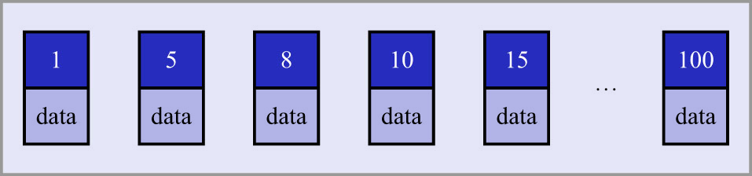
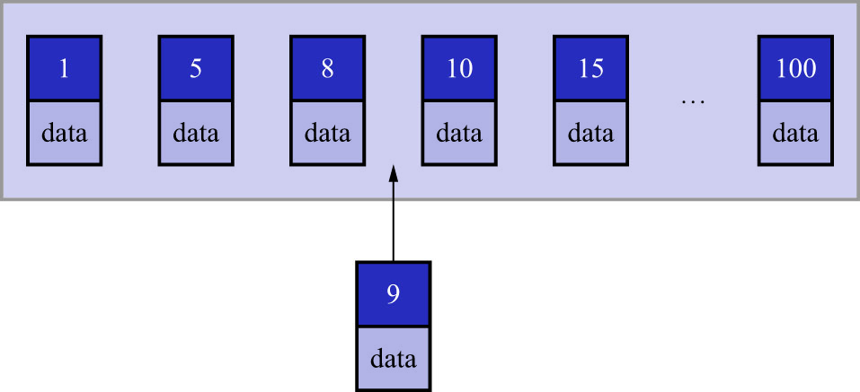

# 7. 新插入记录时主键大小对效率的影响

对于一个使用InnoDB存储引擎的表来说,在没有显式创建索引时,表中的数据实际上存储在聚簇索引的叶子节点中,
而且B+树的每一层数据页以及页面中的记录都是按照主键值从小到大的顺序排序的.
如果新插入记录的主键值是依次增大的话,则每插满一个数据页就换到下一个数据页继续插入.
如果新插入记录的主键值忽大忽小,就比较麻烦了.
假设某个数据页存储的聚簇索引记录已经满了,它存储的主键值在1-100之间,如下图示:

此时,如果再插入一条主键值为9的记录,则它插入的位置如下图示:

可这个数据页已经满了,新记录该插入到哪里呢?
此时需要把当前页面分裂成两个页面,把本页中的一些记录移动到新创建的页中.
页面分裂意味着性能损耗!所以以,如果想尽量避免这种无谓的性能损耗,最好让插入记录的主键值依次递增.
就像`single_table`表的主键`id列具有AUTO INCREMENT属性那样,MySQL会自动为新插入的记录生成递增的主键值
