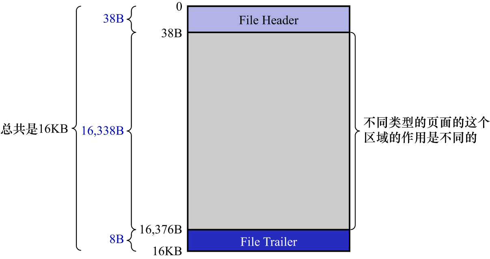

# 2. 页面通用部分

前文说过,数据页(也就是`INDEX`类型的页)由7个部分组成,其中的两个部分是所有类型的页面都通用的.如下图示:

从上图中可以看出,任何类型的页都会包含以下两个部分:

- `File Header`: 记录页面的一些通用信息
- `File Trailer`: 校验页是否完整,保证从内存到磁盘刷新后内容是相同的

`File Header`的各个组成部分如下:

|                 名称                 | 占用空间大小 |                                描述                                |
|:----------------------------------:|:------:|:----------------------------------------------------------------:|
|     `FIL_PAGE_SPACE_OR_CHKSUM`     |  4字节   | 当MySQL的版本低于4.0.14时,该属性表示本页所在的表空间ID;在之后的版本中,该属性表示页的校验和(checksum值) |
|         `FIL_PAGE_OFFSET`          |  4字节   |                                页号                                |
|          `FIL_PAGE_PREV`           |  4字节   |                             上一个页的页号                              |
|          `FIL_PAGE_NEXT`           |  4字节   |                             下一个页的页号                              |
|           `FIL_PAGE_LSN`           |  8字节   |            页面被最后修改时对应的LSN(Log Sequence Number,日志序列号)值            |
|          `FIL_PAGE_TYPE`           |  2字节   |                              该页的类型                               |
|     `FIL_PAGE_FILE_FLUSH_LSN`      |  8字节   |                仅在系统表空间的第一个页中定义,表示文件至少被刷新到了对应的LSN值                |
| `FIL_PAGE_ARCH_LOG_NO_OR_SPACE_ID` |  4字节   |                             页属于哪个表空间                             |

强调几点:

- 表空间中的每一个页都对应着一个页号,也就是`FIL_PAGE_OFFSET`.
  - 可以通过页号在表空间中快速定位到指定的页面
  - 页号由4个字节组成,也就是32位
  - 所以1个表空间最多可以拥有`2 ^ 32`个页
  - 如果按照页的默认大小16KB来算,一个表空间最多支持64TB的数据
  - 表空间的第一个页的页号为0,之后的页号分别是`1/2/3/...`,依此类推

- 某些类型的页可以组成链表,链表中相邻的2个页面的页号可以不连续,也就是说这些页可以不按照在表空间中的物理位置相邻存储
  - 而是根据`FIL_PAGE_PREV`和`FIL_PAGE_NEXT`来存储上一个页和下一个页的页号
  - 注意: 
    - 这两个字段主要是用于`INDEX`类型的页,即数据页在建立B+树后,使用这2个字段为每层节点建立双向链表
    - 一般类型的页是不使用这两个字段的

- 每个页的类型由`FIL_PAGE_TYPE`表示,比如:
  - 数据页的该字段的值为`0x45BF`
  - 后边会介绍各种不同类型的页,不同类型的页在该字段上的值是不同的
