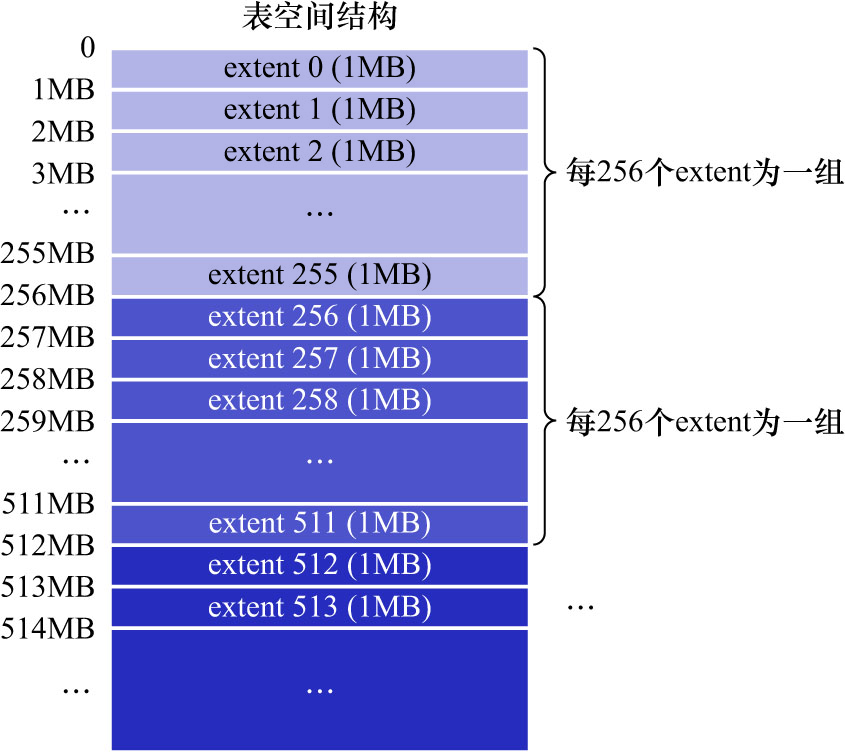
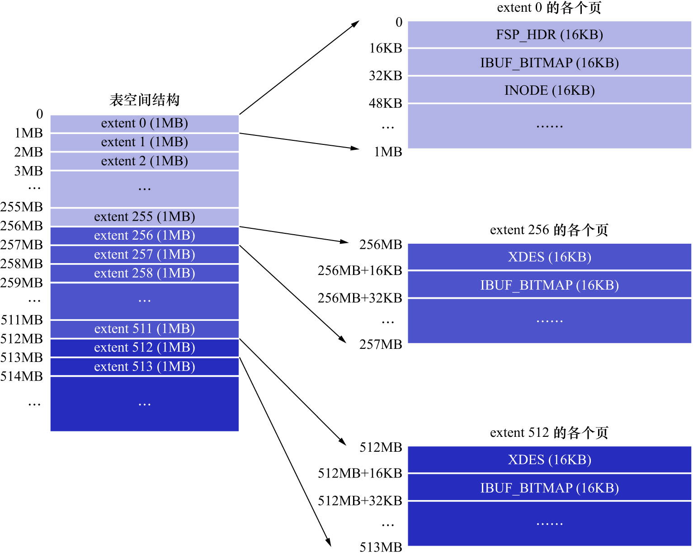

# 1. 区的概念

表空间中的页实在是太多了,为了更好的管理这些页面,InnoDB的设计者提出了区(extent)的概念.
**对于16KB的页来说,连续的64个页就是1个extent.即:1个extent默认占用1MB空间大小**.
不论是系统表空间还是独立表空间,都可以看成是由若干个extent组成的.每256个extent被划分成一组.如下图示:

注意: extent是物理空间中真实存在的概念,而不是逻辑上的概念.可以简单理解为磁盘上1MB的连续空间,这段连续的存储空间中存储了64个页.

注意: 组也是物理空间中真实存在的概念,而不是逻辑上的概念.可以简单理解为磁盘上256MB的连续空间,这段连续的存储空间中存储了256个extent.

其中:
- `extent0 - extent255`这256个extent算是第1个组
- `extent256 - extent511`这256个extent算是第2个组
- `extent512 - extent767`这256个extent算是第3个组(下图中并未画全第三个组全部的extent)

依此类推可以划分更多的组.这些组中,前几个页面的类型都是类似的,如下图示:

第1个组的前3个页面的类型是固定的.也就是说`extent0`这个extent的前3个页面的类型是固定的,分别是:

- `FSP_HDR`: 该类型页面用于**登记整个表空间的一些整体属性以及本组所有的extent的属性**
  - 也就是`extent0 - extent255`这256个extent的属性,后边会详细讲解
  - 注意: **整个表空间只有一个`FSP_HDR`类型的页**

- `IBUF_BITMAP`: 该类型页面用于存储关于Change Buffer的信息.现在先不用关心

- `INODE`: 该类型页面用于存储了许多称为`INODE Entry`的数据结构.现在先不用关心

其余各组最开始的2个页面的类型是固定的.即: `extent256`/`extent512`/`...`这些extent的前2个页面的类型是固定的.分别是:

- `XDES`: 全称为`extent descriptor`,该类型页面用于**登记本组256个extent的属性**
  - 即:
    - 对于在`extent256`extent中的该类型页面存储的就是`extent256 - extent511`这些extent的属性
    - 对于在`extent512`extent中的该类型页面存储的就是`extent512 - extent767`这些extent的属性
  - 上边介绍的类型为`FSP_HDR`的页面其实和类型为`XDES`的页面的作用类似,只是类型为`FSP_HDR`的页面还会额外存储一些表空间的属性
  - 可以简单理解为: 1个`XDES`页面,描述了`256 * 64 - 2 = 16382`个页的某些属性,即描述了1个组的属性
    - 这里减2是因为每组中的前2个页面的类型是`XDES`和`IBUF_BITMAP`,而不是`INDEX`类型的页面
- `IBUF_BITMAP`: 前边说过了

宏观的结构就介绍完了,里边的名词太多,也不用记清楚.只要大致记得: **表空间被划分为许多连续的extent,
1个extent默认由64个页组成,每256个extent划分为1组,每个组的前几个页面类型是固定的**即可.
