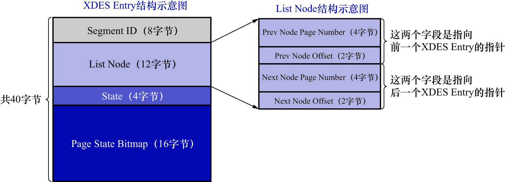
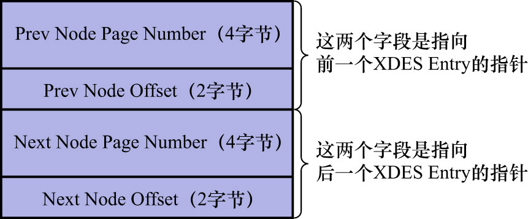

# 0. 概述

表空间由若干个extent组成,这些extent大致可以分为4种类型:

- 空闲的extent: 现在还没有用到这个extent中的任何页面
- 有剩余空间的fragment extent: 表示fragment extent中还有可用的页面
- 没有剩余空间的fragment extent: 表示fragment extent中的所有页面都被使用,没有空闲页面
- 附属于某个segment的extent: 每一个索引都可以分为叶子节点segment和非叶子节点segment,除此之外InnoDB还会另外定义一些特殊作用的segment
  - 在这些extent中的数据量很大时,将使用extent来作为基本的分配单位
  - 这些extent中的页面完全用于存储该segment中的数据(而fragment extent可以存储属于不同segment的数据)

这4种类型的extent也被称为extent的4种状态(State),InnoDB的设计者为这4种状态的extent定义了特定的名词:

|     状态名     |                        含义                        |
|:-----------:|:------------------------------------------------:|
|   `FREE`    |                    空闲的extent                     |
| `FREE_FRAG` |              有剩余空间的fragment extent               |
| `FULL_FRAG` |              没有剩余空间的fragment extent              |
|   `FSEG`    | 附属于某个segment的extent(这里的`FSEG`是`file segment`的缩写) |

注意:
- 处于`FREE`/`FREE_FRAG`/`FULL_FRAG`这三种状态的extent都是独立的,算是直属于表空间
- 处于`FSEG`状态的extent是附属于某个segment的

注: 如果把表空间比作是一个集团军,segment就相当于师,extent就相当于团.一般的团都是隶属于某个师的,
就像是处于`FSEG`的extent全都隶属于某个segment;而处于`FREE`/`FREE_FRAG`/`FULL_FRAG`这三种状态的extent却直接隶属于表空间,
就像独立团直接听命于军部一样

为了方便管理这些extent,InnoDB的设计者设计了一个称为`XDES Entry`的结构(Extent Descriptor Entry),
**每1个extent都对应着一个`XDES Entry`结构**,该结构记录了对应的extent的一些属性.如下图示:

注意: `XDES Entry`是一个数据结构,和之前说的组中的`XDES`是2个概念,组中的`XDES`是一种页面的类型

`XDES Entry`结构有40字节,大致分为4个部分,各个部分的含义如下:

- `Segment ID`(8字节)

每一个segment都有一个唯一的编号,用ID表示.此处的`Segment ID`字段表示就是该extent所在的segment.
当然前提是该extent已经被分配给某个segment了,否则该字段值没有意义

- `List Node`(12字节)

`List Node`部分可以将若干个`XDES Entry`结构串连成一个链表.`List Node`的结构如下图示:

如果想定位表空间内的某一个位置,只需指定页号以及该位置在指定页号中的页内偏移量即可.
 
- `Pre Node Page Number`(前一个`XDES Entry`在前一个extent中所在位置的页号)和`Pre Node Offset`(前一个`XDES Entry`在前一个extent中所在页中的页内偏移量)的组合就是指向前一个`XDES Entry`的指针
- `Next Node Page Number`(后一个`XDES Entry`在后一个extent中所在位置的页号)和`Next Node Offset`(后一个`XDES Entry`在后一个extent中所在页中的页内偏移量)的组合就是指向后一个`XDES Entry`的指针

后续讲解这个由`XDES Entry`结构组成的链表的作用.

- `State`(4字节)

该字段表明extent的状态.可选的有:`FREE`/`FREE_FRAG`/`FULL_FRAG`/`FSEG`.具体释义前文已经说过了

- `Page State Bitmap`(16字节)

该部分共占用16个字节,即128位.1个extent默认有64个页,这128位被划分为64个部分,每个部分2位,对应extent中的1个页.
例如,`Page State Bitmap`部分中:

- 第1位和第2位对应extent中的第1个页面
- 第3位和第4位对应extent中的第2个页面
- 依此类推
- 第127位和128位对应extent中的第64个页面

这2个位中,第1位表示对应的页是否为空闲的,第二个位还没有用到
