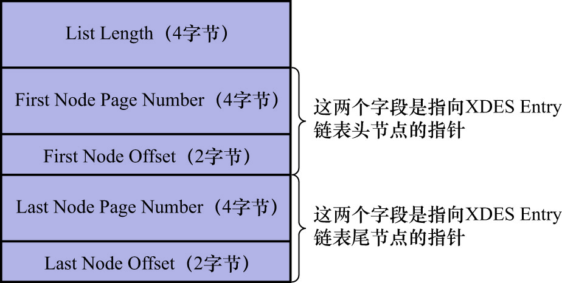

# 2. 链表基节点

前面介绍了一堆链表,该怎么找到这些这些链表呢?或者说怎么找到某个链表的头节点或者尾节点在表空间中的位置呢?
InnoDB的设计者设计了一个名为`List Base Node`(链表基节点)的结构.该结构中包含了:

- 链表的头节点指针
- 链表的尾节点指针
- 该链表中包含了多少节点

的信息.如下图示:

前边说过的每个链表都对应1个`List Base Node`结构,其中:

- `List Length`: 表示该链表一共有多少节点
- `First Node Page Number`(该链表的头节点所在的页号)和`First Node Offset`(该链表的头节点所在的页的页内偏移量): 表示该链表的头节点在表空间中的位置
- `Last Node Page Number`(该链表的尾节点所在的页号)和`Last Node Offset`(该链表的尾节点所在的页的页内偏移量): 表明该链表的尾节点在表空间中的位置

一般把某个链表对应的`List Base Node`结构放置在表空间中固定的位置(具体位置后边会讲到),这样就很容易能定位到某个链表了.
同样的,需要segment来维护的3个链表的`List Base Node`,也是放在segment的固定位置中
