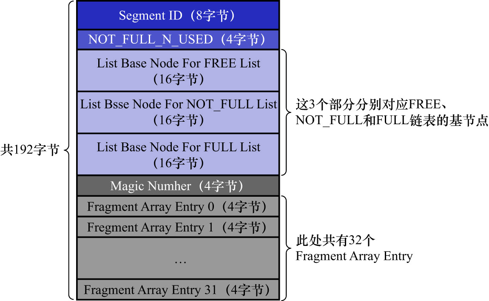

# 4. 段的结构

segment其实不对应表空间中某一个连续的物理区域,而是一个逻辑上的概念,由若干个零散的页面以及一些完整的extent组成.
如同每个extent都有对应的`XDES Entry`来记录这个extent中的属性一样,
InnoDB的设计者也为每个segment定义了一个`INODE Entry`结构来记录该segment中的属性.示意图如下:

`INODE Entry`结构中,各个部分含义如下:

- `Segment ID`: 该`INODE Entry`结构对应的segment的编号(ID)
- `NOT_FULL_N_USED`: 在`NOT_FULL`链表中已经使用了多少个页面
- 3个`List Base Node`: 分别为segment的`FREE`链表/`NOT_FULL`链表/`FULL`链表定义了`List Base Node`
  - 这样当想查找某个segment的某个链表的头节点和尾节点时,直接到这个部分找到对应链表的`List Base Node`即可
- `Magic Number`: 该值用于标记该`INODE Entry`是否已经被初始化了(即把各个字段的值都填进去了)
  - 若该字段值为`97937874`,则表示该`INODE Entry`已经被初始化
  - 否则表示该`INODE Entry`尚未被初始化(不用纠结这个值是否有特殊含义,就是MySQL的设计者规定的）
- `Fragment Array Entry`: segment是一些零散页面和一些完整的区的集合.每个`Fragment Array Entry`结构都对应着1个零散的页面
  - 该结构大小为4字节,表示1个零散页面的页号
