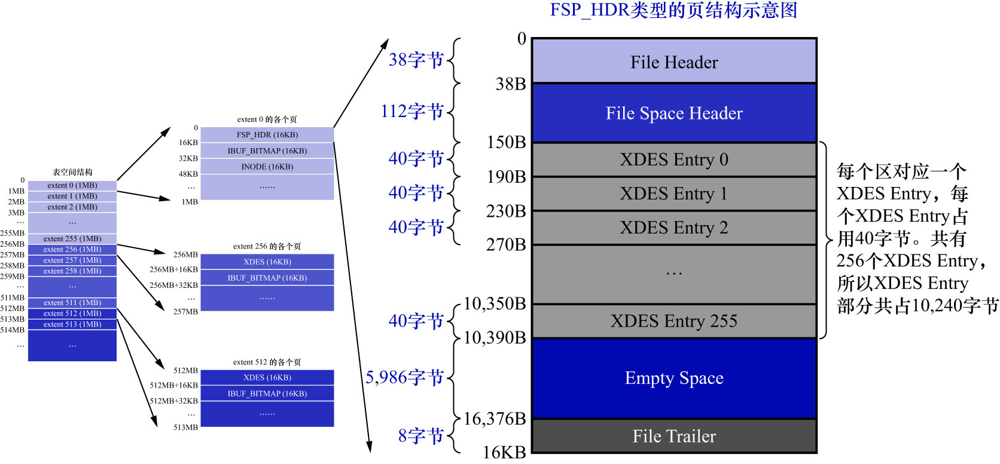

# 0. 概述

`FSP_HDR`类型的页面: 是表空间的第1个页面,也就是第1个组的第1个页面,页号为0.
`FSP_HDR`类型的页面用于存储:

- 表空间的一些整体属性
- 第1个组内256个extent的对应的`XDES Entry`结构

示意图如下:

1个完整的`FSP_HDR`类型的页面大致由5个部分组成:

|         名称          |  中文名   | 占用空间大小  |         简单描述          |
|:-------------------:|:------:|:-------:|:---------------------:|
|    `File Header`    |  文件头部  |  38字节   |       页的一些通用信息        |
| `File Space Header` | 表空间头部  |  112字节  |     表空间的一些整体属性信息      |
|    `XDES Entry`     | 区描述信息  | 10240字节 | 存储本组256个extent对应的属性信息 |
|    `Empty Space`    | 尚未使用空间 | 5986字节  |    用于页结构的填充,无实际意义     |
|   `File Trailer`    |  文件尾部  |   8字节   |        校验页是否完整        |

`File Header`和`File Trailer`就不再强调了.另外几个部分中,`Empty Space`是尚未使用的空间,也不用管.
重点是`File Space Header`和`XDES Entry`这2个部分.
