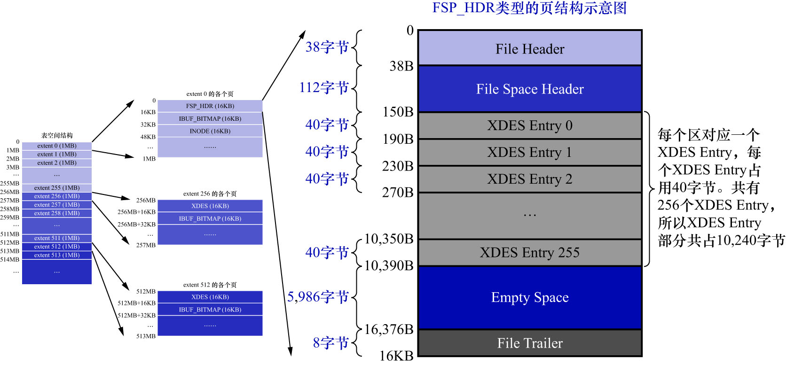
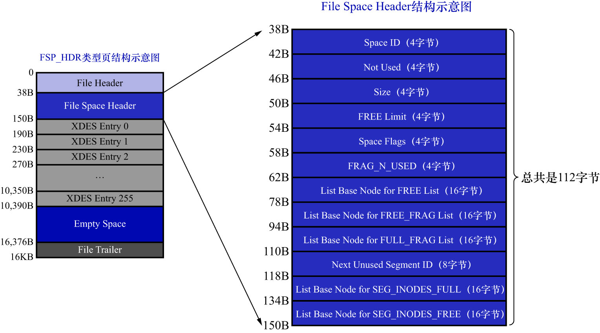

# 1. `File Space Header`部分

`FSP_HDR`类型的页结构示意图如下:

`File Space Header`部分用于存储表空间的一些整体属性,如下图示:

|                    名称                     | 占用空间大小 |                              描述                              |
|:-----------------------------------------:|:------:|:------------------------------------------------------------:|
|                `Space ID`                 |  4字节   |                            表空间的ID                            |
|                `Not Used`                 |  4字节   |                        这4个字节未被使用,可以忽略                        |
|                  `Size`                   |  4字节   |                         当前表空间拥有的页面数                          |
|               `FREE Limit`                |  4字节   | 尚未被初始化的最小页号,大于或等于这个页号的extent对应的`XDES Entry`结构,都没有被加入`FREE`链表 |
|               `Space Flags`               |  4字节   |                      表空间的一些占用存储空间比较小的属性                      |
|               `FRAG_N_USED`               |  4字节   |                    `FREE_FRAG`链表中已使用的页面数量                    |
|      `List Base Node for FREE List`       |  16字节  |                         `FREE`链表的基节点                         |
|    `List Base Node for FREE_FRAG List`    |  16字节  |                      `FREE_FREG`链表的基节点                       |
|    `List Base Node for FULL_FRAG List`    |  16字节  |                      `FULL_FREG`链表的基节点                       |
|         `Next Unused Segment ID`          |  8字节   |                  当前表空间中下一个未使用的`Segment ID`                   |
| `List Base Node for SEG_INODES_FULL List` |  16字节  |                   `SEG_INODES_FULL`链表的基节点                    |
| `List Base Node for SEG_INODES_FREE List` |  16字节  |                   `SEG_INODES_FREE`链表的基节点                    |

`Space ID`/`Not Used`/`Size`这3个字段就不解释了,根据描述一看就能懂.

- `List Base Node for FREE List`/`List Base Node for FREE_FRAG List`/`List Base Node for FULL_FRAG List`:

这3个字段分别是**直属于表空间的**:

- `FREE`链表的基节点
- `FREE_FRAG`链表的基节点
- `FULL_FRAG`链表的基节点

**这3个链表的基节点在表空间的位置是固定的**,就是在表空间的第1个页面(即`FSP_HDR`类型的页面)的`File Space Header`部分.
所以后面定位这几个链表时就相当容易了.

- `FRAG_N_USED`: 该字段表示在`FREE_FRAG`链表中已经使用的页面数量,方便之后在链表中查找空闲的页面

- `FREE Limit`

表空间都对应着具体的磁盘文件.表空间在最初创建时会有一个默认的大小.而磁盘文件一般都是自增长文件,也就是当该文件不够用时,
会自动增大文件大小.这就带来了以下2个问题:

1. 问题1:

    最初创建表空间时,可以指定一个非常大的磁盘文件;然后对表空间完成初始化操作,包括:
    
    - 为表空间中的extent建立对应的`XDES Entry`结构
    - 为各个segment建立`INODE Entry`结构
    - 建立各种链表
    - 等各种操作
    
    但是,对于这个非常大的磁盘文件来说,实际上有绝大部分的空间是空闲的.此时又有2种选择:
    
    - 把所有状态为`FREE`的extent对应的`XDES Entry`结构,都加入到`FREE`链表
    - 只把一部分状态为`FREE`的extent对应的`XDES Entry`结构加入到`FREE`链表
      - 等`FREE`链表中的`XDES Entry`结构不够用时,再把之前没有加入`FREE`链表的状态为`FREE`的extent对应的`XDES Entry`结构加入到`FREE`链表中

2. 问题2:

    对于自增长的文件来说,可能发生1次自增长时,分配的磁盘空间非常大.和上面说的问题一样,此时又有2种选择:
    
   - 把新分配的这些磁盘空间代表的所有状态为`FREE`的extent对应的`XDES Entry`结构,都加入到`FREE`链表
   - 只把一部分状态为`FREE`的extent对应的`XDES Entry`结构加入到`FREE`链表
     - 等`FREE`链表中的`XDES Entry`结构不够用时,再把之前没有加入`FREE`链表的状态为`FREE`的extent对应的`XDES Entry`结构加入到`FREE`链表中

InnoDB的设计者采用的就是后者,中心思想为:**等用到的时候再把没有用到的状态为`FREE`的extent对应的`XDES Entry`结构加入到`FREE`链表**.
因此,InnoDB的设计者为表空间定义了`FREE Limit`这个字段,在该字段表示的页号之后的extent都未被使用,且尚未被加入到`FREE`链表.

- `Next Unused Segment ID`

表中每个索引都对应2个段,每个段都有一个唯一的ID.当为某个表新创建1个索引时,就意味着要创建2个新的段.
如何为这个新创建的段找一个唯一的ID? 去遍历现在表空间中所有的段,以获取当前表空间中最大的`Segment ID`值,必然不是好的方案.
所以InnoDB的设计者提出了这个名为`Next Unused Segment ID`的字段,该字段表明**当前表空间中最大的`Segment ID`的下一个ID,
这样在创建新段时,赋予新段一个唯一的ID值时,直接使用`Next Unused Segment ID`的值,然后把该字段值递增一下即可.

- `Space Flags`

    表空间对于一些布尔类型的属性,或者只需要几个比特就能存储的属性,都存储在了`Space Flags`中.
    虽然该字段只有4个字节(32个比特位),却存储了表空间的很多属性,详细情况如下表:
    
    |      标志名称       | 占用的空间大小(单位: bit) |            描述             |
    |:---------------:|:----------------:|:-------------------------:|
    | `POST_ANTELOPE` |        1         |   表示文件格式是否在`ANTELOPE`之后   |
    |   `ZIP_SSIZE`   |        4         |         表示压缩页面的大小         |
    | `ATOMIC_BLOBS`  |        1         | 表示是否自动把占用存储空间非常多的字段放到溢出页中 |
    |  `PAGE_SSIZE`   |        4         |           页面大小            |
    |   `DATA_DIR`    |        1         |     表示表空间是否是从数据目录中获取的     |
    |    `SHARED`     |        1         |         是否为共享表空间          |
    |   `TEMPORARY`   |        1         |         是否为临时表空间          |
    |  `ENCRYPTION`   |        1         |          表空间是否加密          |
    |    `UNUSED`     |        18        |         没有使用到的比特位         |
    
    注: 不同MySQL版本中的`SPACE_FLAGS`表示的属性可能有些差异,这里列举的是5.7.22版本的.其实现在不用太研究这些标志的含义
    
    - `List Base Node for SEG_INODES_FULL List`/`List Base Node for SEG_INODES_FREE List`
    
    每个段对应的`INODE Entry`结构会集中存放到一个类型为`INODE`的页中.如果表空间中的段特别多,则会有多个`INODE Entry`结构,
    此时可能1个页放不下,需要多个`INODE`类型的页面.这些`INODE`类型的页会构成以下2种链表:
    
    - `SEG_INODES_FULL`链表: 在该链表中,`INODE`类型的页面都已经被`INODE Entry`结构填充满,无空闲空间存放额外的`INODE Entry`
    - `SEG_INODES_FREE`链表: 在该链表中,`INODE`类型的页面仍有空闲空间来存放`INODE Entry`结构
    
    因为现在还没有详细讲解`INODE`类型页,所以后续讲解`INODE`类型的页之后再回过头来看这2个链表
