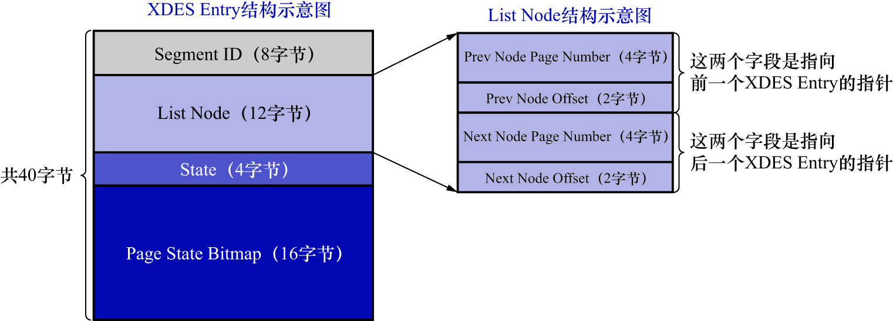

# 2. `XEDS Entry`部分

`FSP_HDR`类型的页结构示意图如下:

紧接着`File Space Header`部分的就是`XDES Entry`部分了,`XDES Entry`就是存储在表空间的第1个页面中.1个`XDES Entry`结构的大小是40字节,
由于1个页面的大小有限,只能存放有限个`XDES Entry`结构,所以才把256个区划分成一组,在每组的第1个页面中存放256个`XDES Entry`结构.

回看`FSP_HDR`类型页面的示意图:

- `XDES Entry 0`就对应着`extent 0
- `XDES Entry 1`就对应着`extent 1`
- 依此类推
- `XDES Entry255`就对应着`extent 255`

每个区对应的`XDES Entry`结构的地址是固定的,因此可以很容易地访问到`extent 0`对应的`XDES Entry`结构(页面偏移量为150字节)/
`extent 1`对应的`XDES Entry`结构(页面偏移量为`150 + 40`字节)/`extent 2`对应的`XDES Entry`结构(页面偏移量为`150 + 80`字节)

