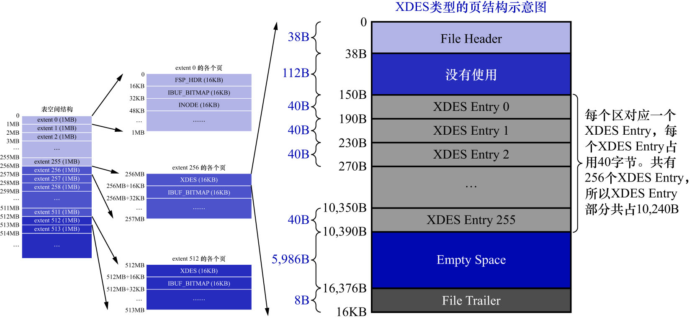

# 2. `XDES`类型

每1个`XDES Entry`结构对应表空间的1个区.虽然1个`XDES Entry`结构只占用40字节,但表空间中区的数量也会不断增多.
在区的数量非常多时,1个单独的页可能就无法存放足够多的`XDES Entry`结构,所以需要把表空间的区分为了若干个组,
每组开头的1个页面记录着本组内所有的区对应的`XDES Entry`结构.由于第1个组的第1个页面有些特殊(它也是整个表空间的第1个页面),
所以除了记录本组中的所有区对应的`XDES Entry`结构以外,该页面还记录着表空间的一些整体属性,
这个页面的类型就是刚刚说的`FSP_HDR`类型,**整个表空间里只有1个该类型的页面**.
除第1个分组以外,**之后的每个分组的第1个页面只需要记录本组内所有的区对应的`XDES Entry`结构即可,不需要再记录表空间的属性**.
为了和`FSP_HDR`类型做区别,把之后每个分组的第1个页面的类型定义为`XDES`,它的结构和`FSP_HDR`类型非常相似:

与`FSP_HDR`类型的页面相比,除了少了`File Space Header`部分之外(也就是除了没有记录表空间整体属性的部分之外),其余的部分是完全相同的.
