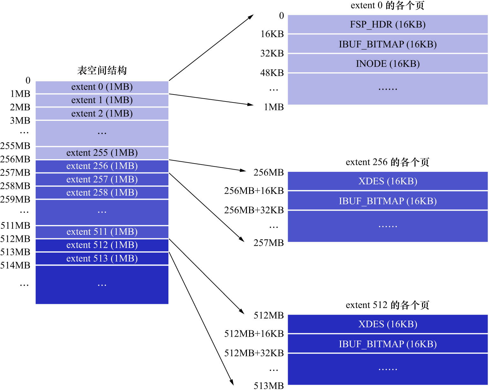
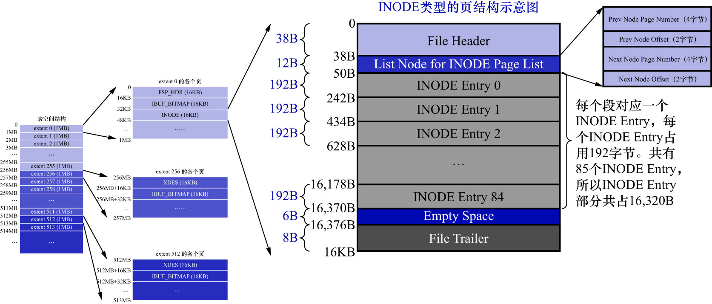

# 4. `INODE`类型

如上图示,第1个分组中的第3个页面的类型为`INODE`.前边说过InnoDB的设计为每个索引定义了2个段,
而且为某些特殊功能定义了些特殊的段.为方便管理,设计者又为每个段设计了一个`INODE Entry`结构,这个结构中记录了关于这个段的相关属性.
这个`INODE`类型的页就是为了存储`INODE Entry`结构而存在的.如下图示:

注: 图中的`628B`写错了,应该是`626B`

1个`INODE`类型的页面是由这几部分构成的:

|               名称                |  中文名   | 占用空间大小  |              简单描述              |
|:-------------------------------:|:------:|:-------:|:------------------------------:|
|          `File Header`          |  文件头部  |  38字节   |            页的一些通用信息            |
| `List Node for INODE Page List` | 通用链表节点 |  12字节   | 存储上一个`INODE`页面和下一个`INODE`页面的指针 |
|          `INODE Entry`          | 段描述信息  | 16320字节 |      存储具体的`INODE Entry`结构      |
|          `Empty Space`          | 尚未使用空间 |   6字节   |         用于页结构的填充,无实际意义         |
|         `File Trailer`          |  文件尾部  |   8字节   |            校验页是否完整             |

`File Header`/`Empty Space`/`File Trailer`这3部分就不讲了,这里重点关注`List Node for INODE Page List`和`INODE Entry`这2个部分:

首先看`INODE Entry`部分,前边已经详细介绍过这个结构的组成了,主要包括:

- 对应的段内零散页面的地址
- 附属于该段的`FREE`链表的基节点
- 附属于该段的`NOT_FULL`链表的基节点
- 附属于该段的`FULL`链表的基节点

每个`INODE Entry`结构占用192字节,1个页面里可以存储85个这样的结构.`INODE Entry`结构如下图示:

重点看`List Node for INODE Page List`.如果1个表空间中存在的段超过85个,那么1个`INODE`类型的页面
不足以存储所有的段对应的`INODE Entry`结构,所以就需要额外的`INODE`类型的页面来存储这些结构.为方便管理
这些`INODE`类型的页面,InnoDB的设计者将这些`INODE`类型的页面串联成2个不同的链表:

- `SEG_INODES_FULL`链表: 在该链表中,`INODE`类型的页面中已经没有空闲空间来存储额外的`INODE Entry`结构了
- `SEG_INODES_FREE`链表: 在该链表中,`INODE`类型的页面中还有空闲空间来存储额外的`INODE Entry`结构

前边在讲`FSP_HDR`类型的页时,提到过该类型的页中有`File Space Header`部分.这两个链表的基节点就存储在`File Space Header`中,如下图示:

也就是说这2个链表的基节点的位置是固定的,从而可以轻松访问到这2个链表.以后每当新创建一个段(创建索引时就会创建段)时,
都会创建一个与之对应`INODE Entry`结构.存储`INODE Entry`的大致过程如下:

1. 先看看`SEG_INODES_FREE`链表是否为空

    如果不为空,直接从该链表中获取一个节点,也就相当于获取到一个仍有空闲空间的`INODE`类型的页面,
    然后把该`INODE Entry`结构放到该页面中.当该页面中无剩余空间时,就把该页放到`SEG_INODES_FULL`链表中

2. 如果`SEG_INODES_FREE`链表为空

    则需要从表空间的`FREE_FRAG`链表中申请一个页面,修改该页面的类型为`INODE`,
    把该页面放到`SEG_INODES_FREE`链表中,与此同时把该`INODE Entry`结构放入该页面
