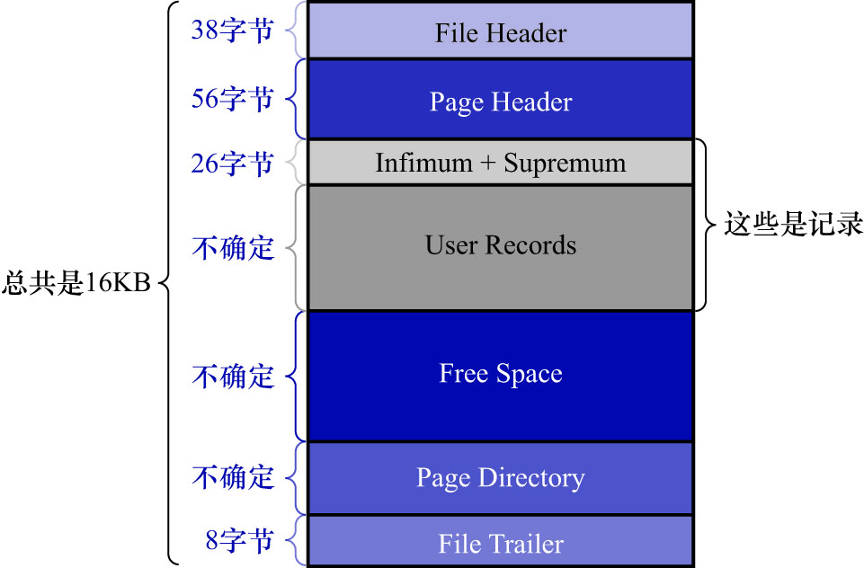
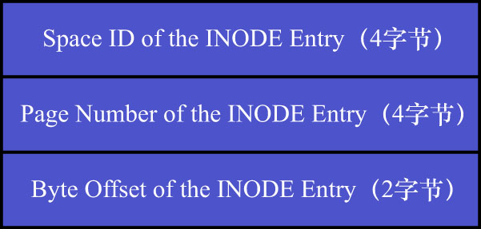

# 6. `Segment Header`结构的运用

1个索引会产生2个段,分别是叶子节点段和非叶子节点段,而每个段都会对应1个`INODE Entry`结构.
如何确定哪个索引对应哪个段呢?所以得找个地方记下来这个对应关系.`INDEX`类型的页的`Page Header`部分用于记录这个关系.

`INDEX`类型的页结构示意图如下:

`INDEX`类型的页的`Page Header`部分各字段释义如下:

|         名称          | 占用空间大小 |                                            描述                                            |
|:-------------------:|:------:|:----------------------------------------------------------------------------------------:|
| `PAGE_N_DIR_SLOTS`  |  2字节   |                                        在页面目录中的槽数量                                        |
|   `PAGE_HEAP_TOP`   |  2字节   |                           还未使用的空间最小地址,也就是说从该地址之后就是`Free Space`                           |
|    `PAGE_N_HEAP`    |  2字节   |       第1位表示本记录是否为紧凑型的记录;剩余的15位表示本页的堆中记录数量(包括`Infimum`记录和`Supremum`记录以及标记为"已删除"的记录)       |
|     `PAGE_FREE`     |  2字节   | 各个已删除的记录通过`next_record`组成一个单向链表,这个单链表中的记录所占用的存储空间可以被重新利用;`PAGE_FREE`表示该链表头节点对应记录在页面中的偏移量 |
|   `PAGE_GARBAGE`    |  2字节   |                                       已删除记录占用的字节数                                        |
| `PAGE_LAST_INSERT`  |  2字节   |                                        最后插入记录的位置                                         |
|  `PAGE_DIRECTION`   |  2字节   |                                         记录插入的方向                                          |
| `PAGE_N_DIRECTION`  |  2字节   |                                      一个方向连续插入的记录数量                                       |
|    `PAGE_N_RECS`    |  2字节   |                     该页中记录的数量(不包括`Infimum`记录/`Supremum`记录/被标记为删除的记录)                      |
|  `PAGE_MAX_TRX_ID`  |  8字节   |                                修改当前页的最大事务ID，该值仅在二级索引页面中定义                                |
|    `PAGE_LEVEL`     |  2字节   |                                      当前页在B+树中所处的层级                                       |
|   `PAGE_INDEX_ID`   |  8字节   |                                     索引ID，表示当前页属于哪个索引                                     |
| `PAGE_BTR_SEG_LEAF` |  10字节  |                                B+树叶子节点段的头部信息,仅在B+树的根页面定义                                 |
| `PAGE_BTR_SEG_TOP`  |  10字节  |                                 B+树非叶子段的头部信息,仅在B+树的根页面定义                                 |

这里为了突出重点,只看如下2个字段:

|         名称          | 占用空间大小 |                                            描述                                            |
|:-------------------:|:------:|:----------------------------------------------------------------------------------------:|
| `PAGE_BTR_SEG_LEAF` |  10字节  |                                B+树叶子节点段的头部信息,仅在B+树的根页面定义                                 |
| `PAGE_BTR_SEG_TOP`  |  10字节  |                                 B+树非叶子段的头部信息,仅在B+树的根页面定义                                 |

`PAGE_BTR_SEG_LEAF`/`PAGE_BTR_SEG_TOP`占用10个字节,它们其实对应一个名为`Segment Header`的结构,如下图示:

各个部分的具体释义如下:

|                名称                | 占用字节数 |            描述            |
|:--------------------------------:|:-----:|:------------------------:|
|  `Space ID of the INODE Entry`   |  4字节  | `INODE Entry`结构所在的表空间ID  |
| `Page Number of the INODE Entry` |  4字节  |  `INODE Entry`结构所在的页面页号  |
| `Byte Offset of the INODE Entry` |  2字节  | `INODE Entry`结构在该页面中的偏移量 |

这样就很清晰了:

- `PAGE_BTR_SEG_LEAF`: 记录着叶子节点段对应的`INODE Entry`结构的地址是:哪个表空间的哪个页面的哪个偏移量
- `PAGE_BTR_SEG_TOP`: 记录着非叶子节点段对应的`INODE Entry`结构的地址是哪个表空间的哪个页面的哪个偏移量

这样子索引和其对应的段的关系就建立起来了.注意:**因为1个索引只对应2个段,所以只需要在索引的根页面中记录这2个结构即可**
