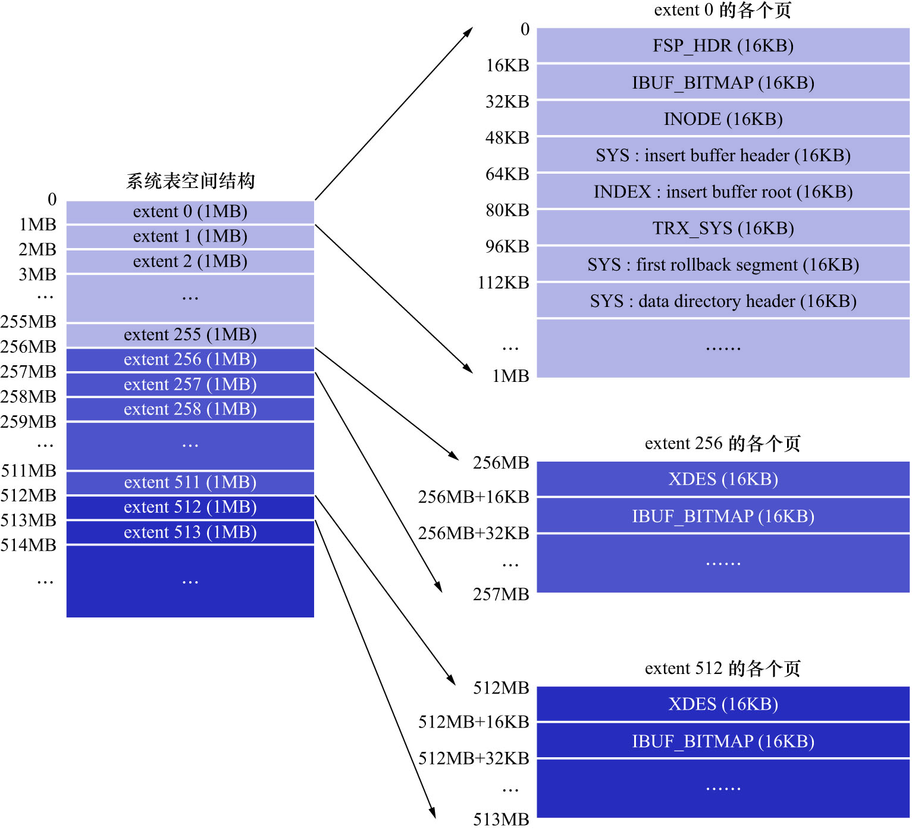

# 0. 概述

与独立表空间相比,系统表空间的一个非常明显的不同之处,就是在表空间开头有许多**记录整个系统属性的页面**,如下图示:

系统表空间和独立表空间的前3个页面(页号分别为0/1/2,类型分别是`FSP_HDR`/`IBUF_BITMAP`/`INODE` )的类型是一致的,
只是页号为3-7的页面是系统表空间特有的,重点关注这些多出来的页面的作用:

| 页号 |   页面类型    |           英文描述           |           描述           |
|:--:|:---------:|:------------------------:|:----------------------:|
| 3  |   `SYS`   |  `Insert Buffer Header`  | 存储`Change Buffer`的头部信息 |
| 4  |  `INDEX`  |   `Insert Buffer Root`   | 存储`Change Buffer`的根页面  |
| 5  | `TRX_SYS` |   `Transaction System`   |       事务系统的相关信息        |
| 6  |   `SYS`   | `First Rollback Segment` |       第一个回滚段的页面        |
| 7  |   `SYS`   | `Data Dictionary Header` |        数据字典头部信息        |

除了这几个记录系统属性的页面之外,系统表空间的`extent 1`和`extent 2`这2个区,也就是页号从`64-191`的这128个页面
被称为`Doublewrite buffer`(双写缓冲区).上述大部分知识都涉及到了事务和多版本控制的问题,这些问题后面会讲到,
现在只讲有关InnoDB数据字典的知识.

注意: 这里页号为3/6/7的页的类型都是`SYS`,只是存储的内容不同
