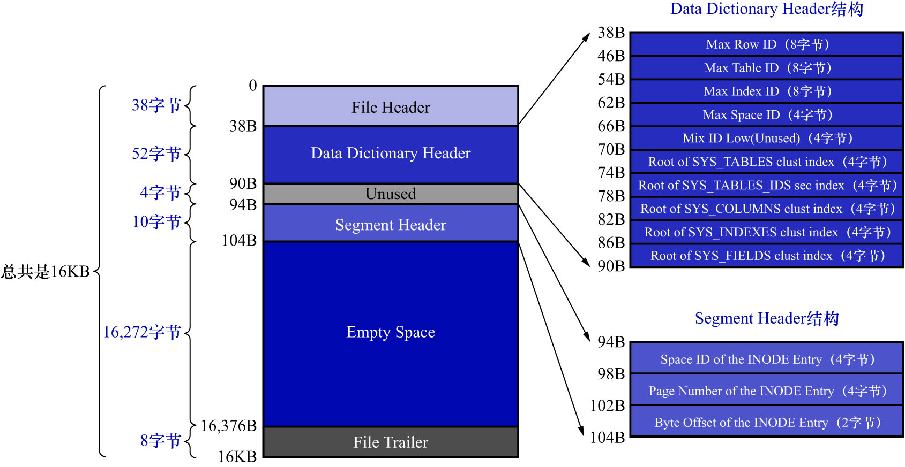

# 5. 5. 系统表空间中页号为7的页面

只要有了上述4个基本系统表,就可以获取其他系统表以及用户定义的表的所有元数据.例如:想查看系统表`SYS_TABLESPACES`中,
存储了哪些表空间以及表空间对应的属性,步骤如下:

- 到`SYS_TABLES`表中根据表名定位到具体的记录,从而获取到`SYS_TABLESPACES`表的`TABLE_ID`
- 使用该`TABLE_ID`到`SYS_COLUMNS`表中就可以获取到属于该表的所有列相关信息
- 使用该`TABLE_ID`到`SYS_INDEXES`表中获取属于该表的所有索引相关信息
  - 索引的信息中包括对应的`INDEX_ID`,还记录着该索引对应的B+树根页面是哪个表空间的哪个页面
- 使用`INDEX_ID`就可以到`SYS_FIELDS`表中获取属于该表的所有索引列相关信息

也就是说这4个表是表中之表,那这4个表的元数据去哪里获取呢? 没办法,只能把这4个表的元数据(即:它们有哪些列/哪些索引等信息)
硬编码到代码中.然后InnoDB的设计者又拿出一个固定的页面来记录这4个表的聚簇索引和二级索引对应的B+树位置,
这个页面就是页号为7的页面,类型为`SYS`,记录了`Data Dictionary Header`(数据字典的头部信息).
除了这4个表的5个索引的根页面信息外,这个页号为7的页面还记录了整个InnoDB存储引擎的一些全局属性.如下图示:

该页面由以下几个部分组成:

|                 名称                 | 占用空间大小  |                简单描述                |
|:----------------------------------:|:-------:|:----------------------------------:|
|        `File Header`(文件头部)         |  38字节   |              页的一些通用信息              |
| `Data Dictionary Header`(数据字典头部信息) |  52字节   | 记录一些基本系统表的根页面位置以及InnoDB存储引擎的一些全局信息 |
|        `Mix In Low(Unused)`        |   4字节   |                未使用                 |
|       `Segment Header`(段头部)        |  10字节   |     记录本页面所在段对应的INODE Entry位置信息     |
|       `Empty Space`(尚未使用的空间)       | 16272字节 |          用于页结构的填充,没啥实际意义           |
|        `File Trailer`(文件尾部)        |   8字节   |              校验页是否完整               |

这个页面里既然有`Segment Header`部分,就意味着InnoDB的设计者把这些有关数据字典的信息当成1个段来分配存储空间,
暂且称之为数据字典段.由于目前需要记录的数据字典信息非常少(可以看到`Data Dictionary Header`部分仅占用了56字节),
所以该段只有1个碎片页,也就是页号为7的这个页.

接下来需要详细介绍`Data Dictionary Header`部分的各个字段:

- `Max Row ID`

如果不显式地为表定义主键,且表中也没有不允许存储NULL值的UNIQUE键,那么InnoDB存储引擎会默认生成一个名为`row_id`的列作为主键.
因为它是主键,所以每条记录的`row_id`列的值不能重复.原则上只要1个表中的`row_id`列不重复就可以了,
也就是说表a和表b拥有一样的`row_id`列是可以的.不过InnoDB的设计者只提供了这个`Max Row ID`字段,
无论哪个拥有`row_id`列的表插入一条记录,该记录的`row_id`列的值就是`Max Row ID`字段的值,然后再把`Max Row ID`对应的值加1,
也就是说这个`Max Row ID`是全局共享的.

注: 当然并不是每分配1个`row_id`值都会把`Max Row ID`刷新到磁盘1次,具体的策略后边会讲

- `Max Table ID`: InnoDB存储引擎中的所有的表都对应一个唯一的ID,每次新建一个表时,就会把本字段的值作为该表的ID,然后自增本字段的值
- `Max Index ID`: InnoDB存储引擎中的所有的索引都对应一个唯一的ID,每次新建一个索引时,就会把本字段的值作为该索引的ID,然后自增本字段的值
- `Max Space ID`: InnoDB存储引擎中的所有的表空间都对应一个唯一的ID,每次新建一个表空间时,就会把本字段的值作为该表空间的ID,然后自增本字段的值
- `Mix ID Low(Unused)`: 这个字段没什么用
- `Root of SYS_TABLES clust index`: 本字段代表`SYS_TABLES`表聚簇索引的根页面的页号
- `Root of SYS_TABLE_IDS sec index`: 本字段代表`SYS_TABLES`表为`ID`列建立的二级索引的根页面的页号
- `Root of SYS_COLUMNS clust index`: 本字段代表`SYS_COLUMNS`表聚簇索引的根页面的页号
- `Root of SYS_INDEXES clust index`: 本字段代表`SYS_INDEXES`表聚簇索引的根页面的页号
- `Root of SYS_FIELDS clust index`: 本字段代表`SYS_FIELDS`表聚簇索引的根页面的页号

注:

在MySQL 8.0中,数据字典已经彻底重构:

- 系统数据字典表(`SYS_TABLES`/`SYS_INDEXES`等)不再使用InnoDB的内部表结构,而是转移到了事务数据字典(Transactional Data Dictionary,TDD)中
- 这些字典数据存放在`mysql`库的系统表中,并且存储在专门的表空间文件`mysql.ibd`中,而不是再依赖`ibdata1`的固定页位置.系统表为:
  - `mysql.tables`
  - `mysql.columns`
  - `mysql.indexes`
  - `mysql.table_stats`
  - `mysql.index_stats`
  - `mysql.dd_properties`
  - `mysql.schemata`
  - `mysql.st_spatial_reference_systems`
  - 注: 这些表内部表(DD tables,Data Dictionary tables),并不会在`SHOW TABLES FROM mysql;`中列出来,也不允许直接`SELECT`
- 因此在MySQL 8.0中,页号为7的页面不再是`Data Dictionary Header`的存放位置,系统表空间中也不存在以前的`Data Dictionary Header`结构

换言之:

- MySQL 5.X:系统表空间中页号为7的页存储了`Data Dictionary Header`结构,页面类型为`SYS`
- MySQL 8.X:`Data Dictionary Header`结构已经废弃,系统表空间中页号为7的页不再有这个含义

